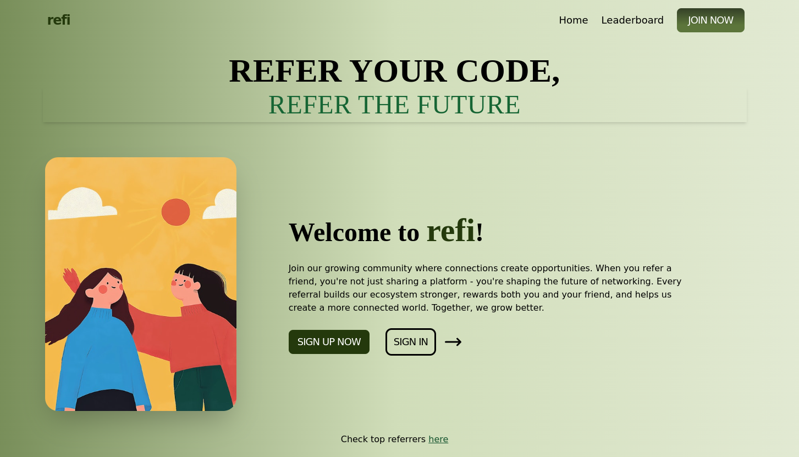

Check live at [here](https://referral-system-frontend.onrender.com/)

## Architecture


## Local Setup

```
git clone https://github.com/bandhan-majumder/Referral-System
cd Referral-System
npm i
cd api
npm i
cd .. && cd client
npm i
```
## Change .env.example to .env
go to `api/` and run the following command

```
mv .env.example .env
```
## DB Setup (Postgres by default)
Connect your database URL in the `.env` file present in `api/`

### local dB setup with Docker
```
docker run --name my-postgres -e POSTGRES_PASSWORD=mysecretpassword -d -p 5432:5432 postgres
```
if you are using exactly same config, you don't need to change anything in .env file. Else you have to modify the password and names

### Global options
Go to any of the site and get your DB URL and paste in the env

1. Neon DB : [visit](neon.tech)
2. Aiven: [visit](https://aiven.io/)

make sure to run 
```
npx prisma migrate dev --name Initialize the schema
npx prisma generate
```

## Access DB via CLI
```
psql -h localhost -d postgres -U postgres
```

## Run the backend
Go to  `api` folder and run
```
tsc -b
node dist/index.js
```

## Run the frontend
Go to `client` folder and run

```
npm run dev
```

## JWT Secret Setup
JWT tokens are exposed in the code which should be avoided. Try to add them in .env and import from there. Tokens are `SECRET` in this proj. By default it's `hardcoded as ""` which is not recommended. So even without changing the SECRET, the project will run but will not be secure.

## Run
Go to the browser and run `localhost:5173`


## Make changes
Everytime you change anything in backend,make sure to run
```
npx prisma generate
tsc -b
node dist/index.js
```
## Backend issue
Make sure your db is connected. If you are using docker, make sure the container is running. Check with
```
docker ps
```
if it has been stopped, grab the id with
```
docker ps -a
```
and run
```
docker start <_id_>
```
